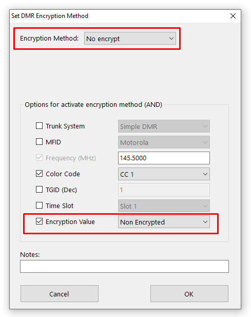

# How To Use

## Creating DMR Encryption Method row

Initially it is assumed that you have a encryption key, you know what encryption algorithm it is designed for and what frequency the radio is transmitting on.

Try to minimize the number of parameters you select.

If you have selected a value, it must be present when transmitting a digital signal, if it is not, the method with these parameters will not be used by the firmware.

Sorting the rows in the list for complex cases is important.

The screenshots may differ for different versions of CFT but the meaning is the same.

### General case

It's simple, we choose the values that we initially know. In this case, we have one known frequency on which all radio transmissions are protected by one encryption key.

### General but more complex case

This and the other more complex cases are similar. We must select the conditions under which the right encryption key is chosen.

Suppose we have one frequency on which radio stations with different color codes work, the stations that work with CC1 have the encryption key B00B555555 and CC2 has the encryption key FACEB00B55. 

In this case we have to create two data rows where we have the same frequency but different encryption keys and color codes.

### Special case

Suppose that there are many broadcasts that are encrypted with a key but one of the radio station does not have a key and the broadcast is not encrypted. For this purpose, when selecting Encryption Method, the value is "No encrypt".  You must also select "Non Encrypted" in the Encryption Value field

### Unprocessed cases

There are cases when all parameters of signals coincide but in one case the transmission is encrypted and in the other case it is not. Yes, it happens that there is an encrypted signal, but there is no encryption flag and vice versa. In general, the current set of parameters does not allow processing such cases.
