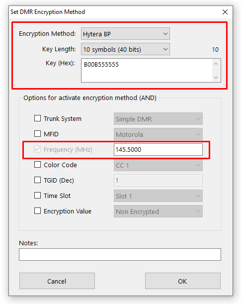
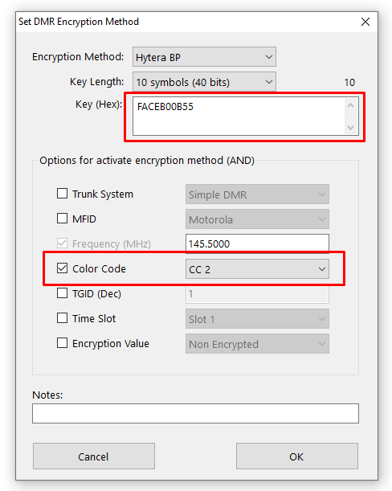
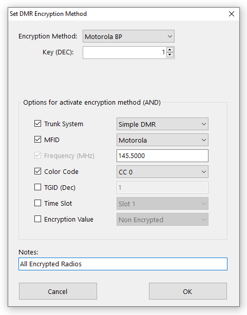
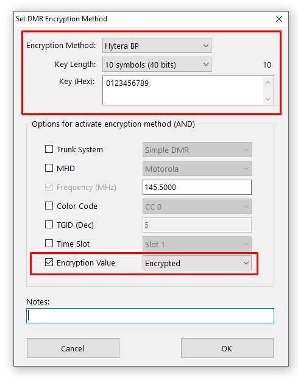

# How To Use

## The Graphical User Interface of the CFT Program

The CFT program creates a project that allows you to enter decryption keys to specific frequencies. Exporting these settings creates the **alice.cft** file. Do not change this file's name when saving it to the scanner. Place **alice.cft** in the root directory "\\" of the Scanner's memory card (for example, E:\\).

**Make sure to backup your alice.cft file from time to time as it contains important data & your purchased License Key(s).** You can do so by manually creating a copy of the **alice.cft** file and naming it meaningfully, such as "alice - Backup 20240229.cft". Save it locally on your computer or in the cloud. To use that backup later, if needed, rename it back to **alice.cft** and copy it to the root of the scanner's memory card.

The upper ribbon and icons of the CFT program are quite self explanatory. 
Create a New project by going to File > New, or by clicking on , or by using Ctrl + N.
Open an already saved .cfp project by going to File > Open..., or by clicking on , or by using Ctrl + O.
Make sure to Save your project from time to time, by going to File > Save or Save As..., or by clicking on , or by Ctrl + S.

To import an existing alice.cft file click on File > Import CFT file ...
**To export your project as an alice.cft file (to be saved in the scanner), click on File > Export CFT file ...**

You may have issues Saving the project .cfp file or the alice.cft file to your Documents directory, so Save it to a different location such as Downloads.
You will be prompted to Save your project when Exiting.

To Add a line to the project file click on , or press Insert.
To Duplicate an existing line, including all its data, select that line and click on .
To Delete an existing line, select that line and click on , or press Delete. Note that this action is irreversible.

To Sort the lines according to their frequency, click on the "Frequency, MHz" column title.
To manually move a line up or down, select that line and click on  or .

The Filter drop-down box allows you to filter between the different views of All, DMR, and NXDN rows.

Edit > Add Encryption Row enables you to add a row to your project. You should select the relevant encryption type.

Edit > Scanners and Licenses ... enables you to Add, Edit, and Delete a scanner. Each scanner can have a unique name, Licenses and Key Mapping. 
You can also paste the License(s) you have purchased. Do not forget to press OK and Close when done.

Tools > Debug Logs Filtering enables you to view the debug logs in a filtered manner. This option is for advanced users only.

The Help > About menu contains the version number and useful links for inpformation.

Make sure to use the latest version.

The parameters that you enter for each entry will be reflected in the main table view. Unmarked values will be denoted by "-".

Each entry has an optional Notes field that is there for your convenience. It is not taken into account in the decryption process nor saved to the scanner.

## Creating DMR (Motorola BP or Hytera BP) Encryption Method row

Initially it is assumed that you have an encryption key, you know what encryption algorithm it is designed for and what frequency the radio is transmitting on.

Try to minimize the number of parameters you select.

If you have selected a value, it must be present when the digital signal is received, if it is not, the method with these parameters will not be used by the firmware.

Sorting the rows in the list for complex cases is important.

The screenshots may differ for different versions of CFT but the meaning is the same.

### General case

It's simple. We choose the values that we initially know. In this case, we have one known frequency on which all radio transmissions are protected by one encryption key.

### General but more complex case

You may encounter a scenario where on one frequency there are two DMR repeaters. One with Color Code 1 and the second with Color Code 2. They are not related to each other. CC1 is Encrypted, but CC2 is not Encrypted. In that case we need only one entry in CFT:
Encryption Method with the Key; Frequency of course; and Color Code is marked with "CC 1" (in this case, because that is the encrypted CC).

This and the other more complex cases are similar. We must select the conditions under which the right encryption key is chosen.

Suppose we have one frequency on which radio stations with different color codes work. The stations that work with CC1 have the encryption key B00B555555 and CC2 has the encryption key FACEB00B55, for example. 

In this case we have to create two data rows where we have the same frequency but different encryption keys and color codes.

### Special case

Suppose that there are many Talk Groups that are encrypted with a key, but only one specific Talk Group does not use a key and its broadcast is clear. You must select "Non Encrypted" in the Encryption Value field. 
At the end, you will have two entries for the same frequency: 

one is with no key entered (Encryption Method = No Encrypt), with the specific TGID that is clear, and with an Encryption Value of "Non Encrypted"; 

and another entry with the same frequency, with the correct Encryption Method and Key entered, without marking any TGID.

### Mixed use-case

In case that different users of the same Talk Group use encrypted and clear voices at the same time, we call that a Mixed situation.
We only need to enter one entry. That entry contains the single encryption key, the single frequency (no need to mark or enter a TGID), and the Encryption Value should be "Encrypted".

### Unprocessed cases

There are cases when some transmission streams are encrypted but the received signals do not contain the encryption internal flag in the data, or that an encryption flag is present in the stream but the transmission is not really encrypted. In general, the current set of parameters does not allow processing of such cases, and the voices might sound garbled.

